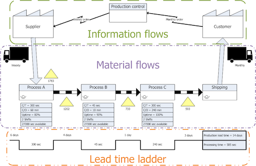
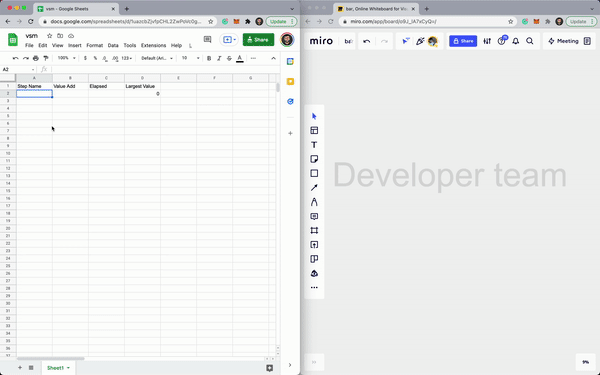
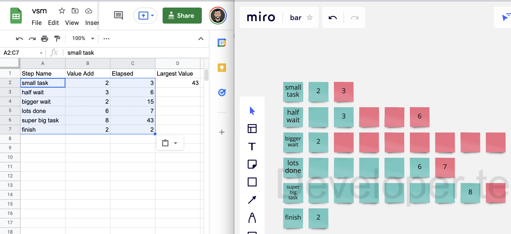
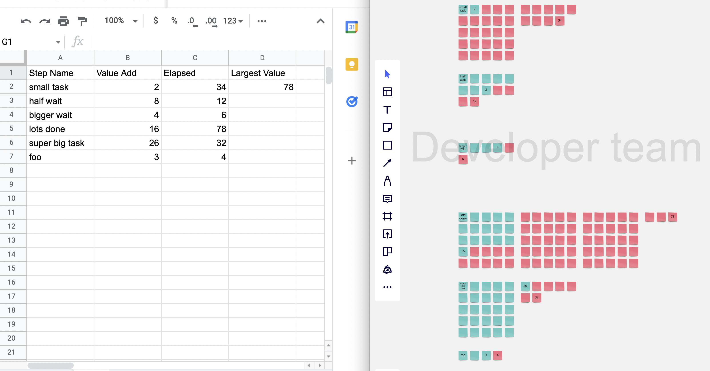

# VSM Visualization

## How traditional value streams work

[Value-stream mapping](https://en.wikipedia.org/wiki/Value-stream_mapping) on wikipedia.



Each step is represented in a uniform fashion on the diagram. You can scan the diagram and find out that 6 days is the largest lead time, however this takes more effort to do the more steps we add. There's a high cognitive burden when trying to process numbers and find the largest one.

This **isn't the only way** we can represent the data, and our visulizations shouldn't stop here!

What if we could **more easily** visulaize the flow of work, and the biggest contraints in the system?

## VSM Visualizer (The perfect companion to the VSM)

This script creates a **Value Stream Map Visualization** in Miro, using Google Sheets as in input.



It's a slightly different way to view the data that's captured in a VSM workshop that can compliment more traditional daigrams.


## Running the script

The script connects to miro and sheets APIs, and expects some env vars and an authentication file `credentials.json`.

Once you have the [required auth/setup](#authentication-and-setup), run the script with the following commands:

```
export MIRO_TOKEN='XXX'
export MIRO_BOARD='XXX'

export SHEET_ID='XXX' # or skip this to use the example sheet

python3 ./vsm.py
```

[Example sheet](https://docs.google.com/spreadsheets/d/1uazcbZjvfpCHL2ZwPoVc0gWjK7R5pMO9D8cxkKQ40C0/) and miro board:


### Controlling the grid (optional env vars):

This part isn't required, but for those wanting more control on how the diagram looks, there are two env vars that you can use.

| Env Var  | Default | Info  |
|---|---|---|
| `GRID_X`  | largest value in sheet which is calulated and stored in `D2` | Specifies how large the grid should be along the X axis  |
| `GRID_Y` | `1` |  Specifies how large the grid should be along the Y axis |

#### Default grid (one row)
The default values result in a single row for each step, with each neatly fitting below the other and no wrapping or varied spaces between steps.

It's easy to tell which steps are the longest, though for large numbers you'll have to zoom out to see the whole VSM.


#### Custom grids
It's possible to specify any grid size (e.g 5x5, 2x12, 100x3), with grids repeating in the X axis as needed. This can be desirable to make use of vertical space when you steps have large numbers.

Here's the same data, with `GRID_X=5`,`GRID_Y=5` (creating a 5x5 grid for each step, and for steps with more than 25, multiple grids along the x axis):


The script ensure uniform spacing between steps based on the largest possible row size, in this case `GRID_Y=5`. This means more space between steps that don't have large numbers.

## Authentication and Setup

You will need authentication for both miro and google sheets.

**Miro**

Create miro token: https://developers.miro.com/docs/getting-started

Create miro board (or use existing):

```
  curl --request POST \
    --url 'https://api.miro.com/v1/boards?fields=foo' \
    --header 'Accept: application/json' \
    --header 'Authorization: Bearer XXX' \
    --header 'Content-Type: application/json' \
    --data '
```

Env vars for the script:
```
export MIRO_TOKEN='Bearer XXX'
export MIRO_BOARD='XXX'

```

**Google Sheets**

https://console.cloud.google.com/apis/dashboard
enable apis and services > sheets

https://console.cloud.google.com/apis/credentials
oauth > desktop

save as `credentials.json`

Env vars for the script:
```
export SHEET_ID='XXX' # or skip to use the example sheet
```

---

Also posted as [Value Stream Map (VSM) Visualization](https://www.drewkhoury.com/post/2021-11-24_value-stream-map-visualization/) on drewkhoury.com
